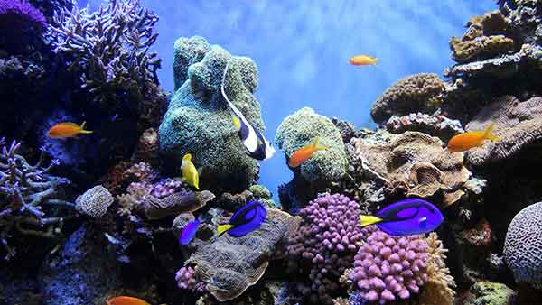
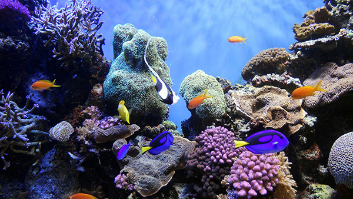

<!DOCTYPE html>
<html lang="en">
  <head>
    <meta charset="UTF-8" />
    <title>Web Images</title>
  </head>

  <body>

    <h1>Web Images</h1>

    
Original Image: 1.9MB

    
    
Low quality (10%). File size: 30.01k

    
    
Medium quality (57%). File size:88.42k 

    
    
High quality (79%). File size:152.2k 

    
    
Very quality (81%). File size:155.3k 

    
    
Maximum quality (100%). File size: 213.4k

  </body>
</html>
